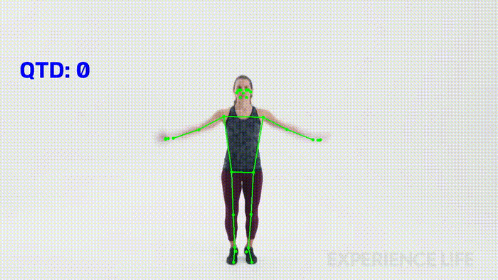

# Contador de Polichinelos com Visão Computacional

Sistema desenvolvido em Python capaz de **detectar os movimentos corporais e contar automaticamente os polichinelos realizados**.

O projeto utiliza detecção de pose para acompanhar os movimentos do corpo e identificar quando uma repetição é realizada.
## 🎥 Demonstração



### Como funciona

O vídeo é analisado frame a frame pelo **MediaPipe Pose Landmarker**, que identifica os principais pontos do corpo. A partir deles, o sistema analisa:

- **Ângulo dos braços:** identifica se os braços estão fechados ou abertos.
- **Posição das mãos:** verifica se estão acima da cabeça, ajudando a confirmar a posição aberta.
- **Distância entre os pés:** verifica se as pernas estão próximas ou afastadas. 

Com essas informações, o sistema identifica duas posições:

- `closed` — braços fechados e pernas próximas.
- `open` — braços abertos, pernas afastadas e mãos acima da cabeça.

O sistema acompanha a sequência `closed → open → closed`. Quando essa sequência é concluída, uma repetição é contabilizada.


## Tecnologias

- Python
- OpenCV
- MediaPipe

## 📁 Estrutura do projeto

```text
jumping-jack-counter/
├── assets/
│   └── demo.gif
├── models/
│   └── pose_landmarker_full.task
├── videos/
│   ├── jumping_jacks.mp4
│   └── jumping_jacks_result.mp4
├── config.py
├── pose.py
├── main.py
├── requirements.txt
└── README.md
```

## Como executar

```bash
git clone https://github.com/devthayron/jumping-jack-counter.git
cd jumping-jack-counter

python3 -m venv venv
source venv/bin/activate    # Linux / macOS
# venv\Scripts\activate     # Windows

pip install -r requirements.txt

python main.py
```

Durante a execução:

* `Q` — encerra a aplicação.

O vídeo processado é salvo em:

```text
videos/jumping_jacks_result.mp4
```

## Próximos passos

* Melhorar a robustez da detecção das repetições.
* Testar com vídeos de diferentes pessoas e enquadramentos.
* Adicionar suporte à webcam.
* Explorar outros exercícios utilizando detecção de pose.

## Autor

**Thayron Higlânder**

LinkedIn: [https://www.linkedin.com/in/thayron-higlander](https://www.linkedin.com/in/thayron-higlander)